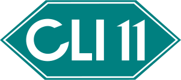

# CLI11: Command line parser for C++11



CLI11 is a command line parser for C++11 and beyond that provides a rich feature set with a simple and intuitive interface.

## instructions for building custom CLI11.hpp header


```bash
mkdir build
cd build
cmake -DCLI11_SINGLE_FILE=ON ..
make -j
```

Resulting single-header will be located in:

```cpp
build/include/CLI11.hpp
```

And is ready to be copied to your project
